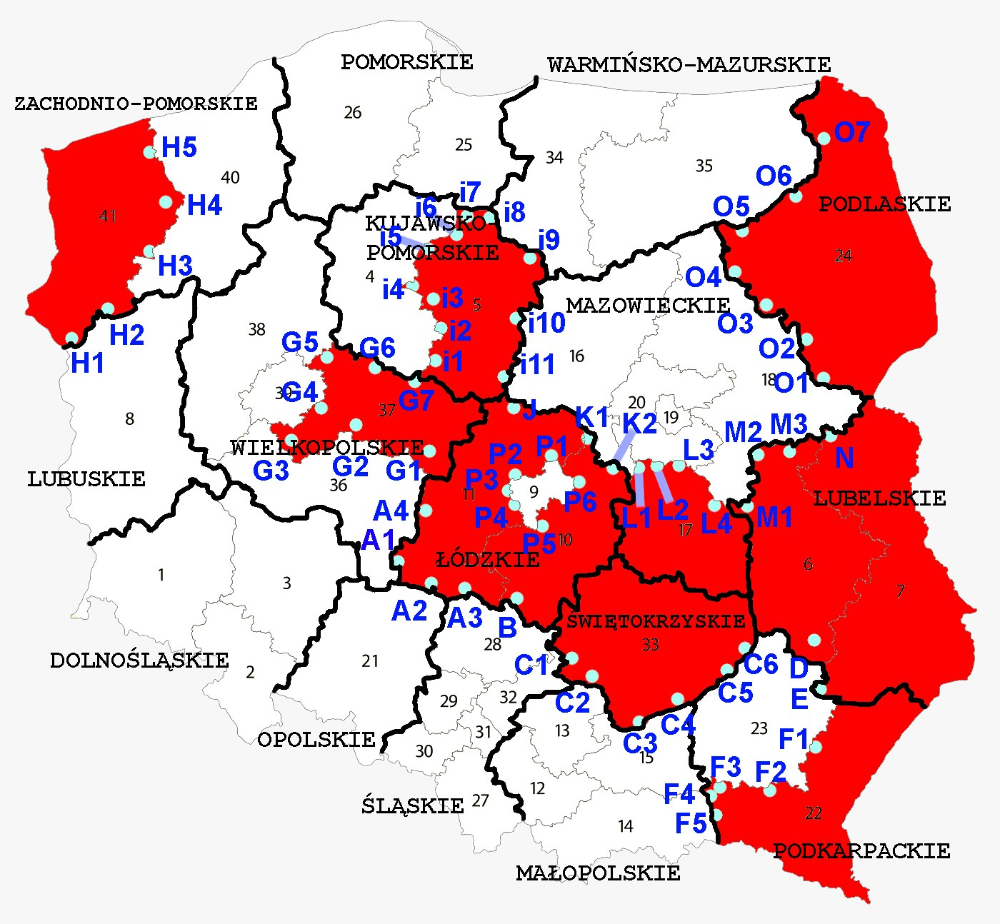
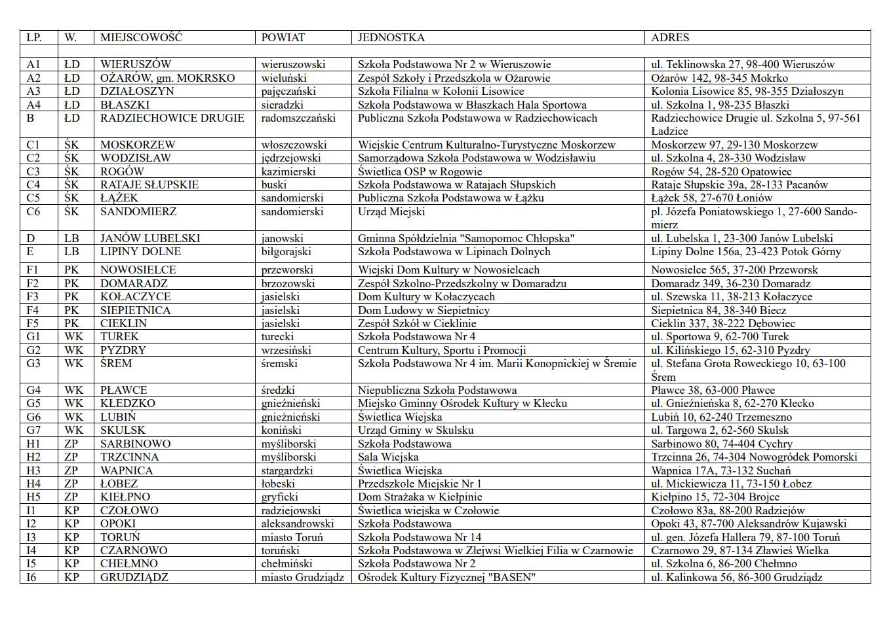
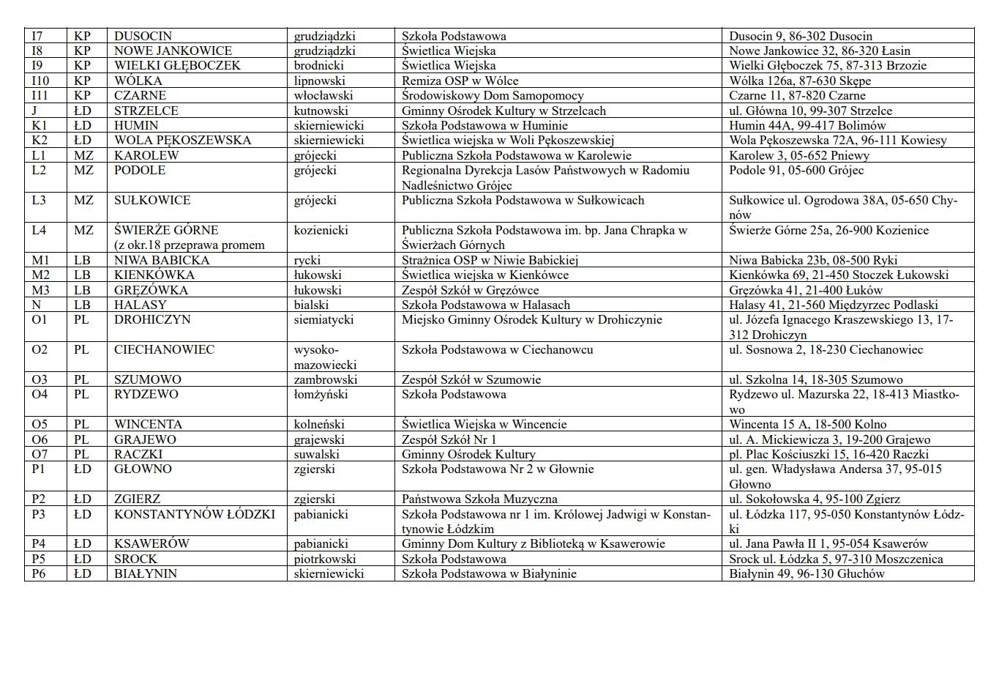

[Spot 1 - tania woda, gaz i prąd](https://www.youtube.com/watch?v=Ar2JUmLVB4E)

[Spot 2 - jak we wrześniu 1939](https://www.youtube.com/watch?v=cpexDHltLBM)

[Spot 3 - nie dzielimy ludzi](https://www.youtube.com/watch?v=mB-5iaI5o-Q)

[Spot 4 - Demokracja, my zwykli obywatele musimy się angażować i wzajemnie popierać](https://www.youtube.com/watch?v=zbC_neAdY8k)

[Materiały na google drive](https://drive.google.com/drive/folders/1VGRWxLcdxbULb7gJ4ENVkQwAFo0R8IuS?fbclid=IwAR34yAFZ59gyCuKP4wG_yQreDY5hh3IfYazuOHFlNupue5jZOhoUiQk_2hk)

[Gdzie głosować? Mapa lokali wyborczych](https://geoportal-krajowy.pl/na-mapie-wybory#x=20.682000241929284&y=52.11262447980542&z=13.48)

# [Na kogo głosować? Lista kandydatów](https://wybory.gov.pl/sejmsenat2023/pl/komitet/29637)

